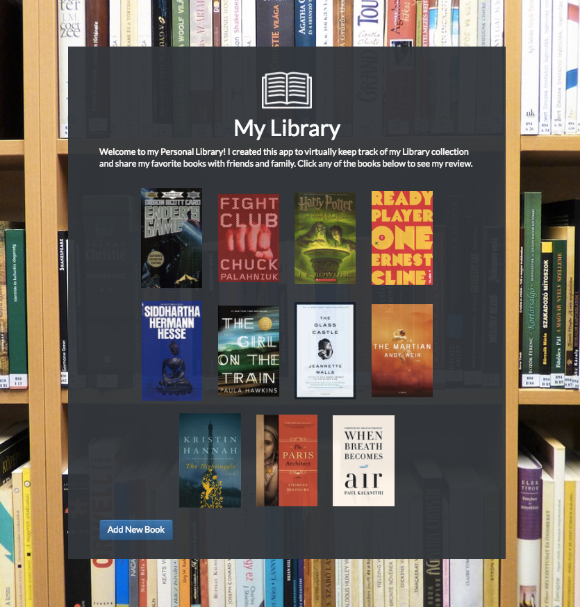
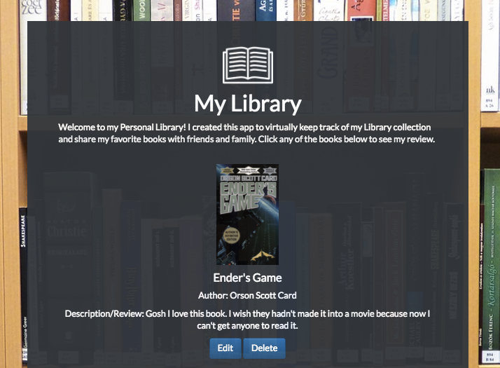
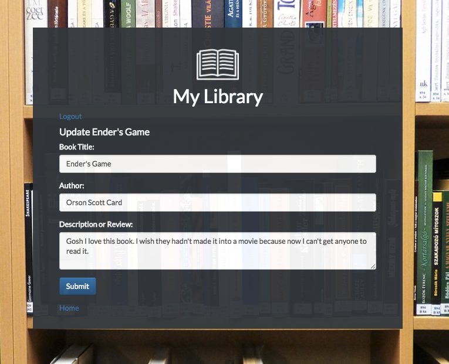
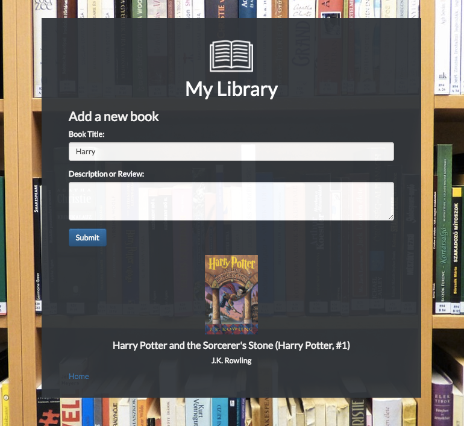

# My Library
---
<h2><a href="http://library.juliemdyer.com" target="_blank">Live Site</a></h2>

## What It Is
I made this app in Week 11 of DigitalCrafts. Our teacher was unfortunately sick and since he was out we had a week of "self study." I decided to take the latter half of that week to learn Ruby and Sinatra. I was surprised by how quickly I was able to pick it up and how many similarities there were between Ruby/Sinatra and Python/Node.js/Express. That being said, I still faced a number of challenges that come along with building an app in a few days in a brand new language without any outside help.


## What I used
* Ruby
* Sinatra
* ERB (Embedded Ruby)
* ajax
* PostgreSQL
* HTML
* CSS
* jQuery
* GoodReads API

## Site Walkthrough
<p>This is the main page - all my favorite books are displayed and there is a button for Adding a new book.</p>
<p align='center'>
    </img>
</p>

<p>If you click on any of the books you'll see the Title, Author name, and my Description/ Review. You'll also see the Edit and Delete buttons. Click the book again to hide this info.</p>

<p align='center'>
    </img>
</p>
<p>Click the edit button to make changes to any book entry. The current values are auto loaded so you only have to edit the fields that you want to update.</p>

<p align='center'>
    </img>
</p>
<p>Clicking Add New Book will take you to this page. Here I used the GoodReads API to load search results at each keyup event. Once you've entered the full title of the book and a review you can click submit. The Author will automatically be loaded but will take your title instead of the GoodReads title.</p>
<p align='center'>
    </img>
</p>

## Challenges

### Challenge 1 - Saving Book Data
<p>When I first started working on this app I didn't know how to connect to Postgres so I was just saving all the book data as hashes in an array and reading/writing to the file. When I decided to take the app a little further I realized I really needed to work with a database.</p>
<p>Luckily I was able to get some help hooking up postgreSQL with Sinatra and once I got that up and running and was able to make queries to the database things were a lot easier.</p>
<p>This is the code that is run when the Submit button is clicked on the Add New Book page. It originates from my front end JavaScript file which uses jQuery to grab all the info on the page and send it back to Sinatra to update the database. When the front end receives the response it re-routes to the home page where you'll see the newly added book.</p>

```Ruby
# Add book form submission
post("/save_book") do
    @title = params[:title]
    @author = params[:author]
    @description = params[:description]
    @cover = params[:cover]
    config = YAML::load_file "config.yml"
    conn = PG.connect( dbname: 'library', host: config["host"], user: 'postgres', password: config["password"] )
    conn.exec( "insert into books values (default, $1, $2, $3, $4)", [@title, @author, @description, @cover] )
    response = "saved"
    # redirect ("/")
end
```

### Challenge 2 - Showing all books / Working with ERB
<p>I used Embedded Ruby (ERB) templates to update all the dynamic content, like books on the homepage. This was pretty similar to Handlebars so I at least understood the concept. It seems like there's a lot more flexibility with ERB in that you can write more actual Ruby code that will execute. One thing I actually found pretty challenging was just that Atom (my text editor) doesn't have a good viewer (? not sure if that's what it's called) for ERB. So I was seeing a bunch of errors and the syntax just looked really weird, so it was hard to see if I had any syntax errors. For example usually a dynamic element will be a different color or something, but with this it would just look like a string, so was very confusing to know if it was picking it up as a variable/dynamic content.
</p>
<p> This is the ERB template for the home page. The each method takes an array and then an each_book div is added to the page.</p>

```HTML
<div class="all_books">
<% @output.each do |book| %>
    <div class="each_book">
        ">
        <div class="info">
            <h4 class="book_title"><%= book["title"] %> </h4>
            <p>Author: <%= book["author"] %> </p>
            <p>Description/Review: <%= book["description"] %> </p>

            <form action="/update/<%=book["title"]%>/<%=book["author"]%>/<%=book["description"]%>" method="post" class="buttons">
                <input type="submit" name="update" value="Edit" class="btn btn-primary">
            </form>


            <form action="/delete/<%= book["title"] %>" method="post" class="buttons">
                <input type="submit" name="delete" value="Delete" class="btn btn-primary">
            </form>
        </div>
    </div>
<% end %>
</div>
```

<p>This is the Ruby code that supplies the dynamic content. I make a database query and get back the data. This was a little different than the database queries I was used to making in Express. The data didn't come back as an array so I had to loop over it and add each book to an array so that I could use that in ERB's each method.</p>
<p>Another thing I never quite figured out was the connection. For every database call I had to add the config and the connection in that block or it wouldn't run. That seemed strange to me.</p>

```Ruby
def book_data()
    config = YAML::load_file "config.yml"
    conn = PG.connect( dbname: 'library', host: config["host"], user: 'postgres', password: config["password"] )
    conn.exec( "SELECT * FROM books order by title" ) do |result|
        books_array = []
        result.each do |row|
            books_array.push(row)
        end
        return books_array
    end
end

# Homepage
get("/") do
    @output = book_data()
    erb :welcome
end
```


### Challenge 3 - Working with the GoodReads API
<p> I wanted to display the book covers so I researched a bunch of different ways to do this. At first I found some Ruby code that would convert a book title to an ISBN number. Working with that I found a resource that would allow you to get a book cover url just from the ISBN. This was a pretty bare bones solution and I found that the program that would return an ISBN wasn't all that good - half the time there wouldn't be a book cover image that went with that number.</p>
<p> So I was looking for a more reliable solution and was starting to realize I'd need to work with an API. The GoodReads API documentation was really good, and I was able to get queries working with Postman so I went with that. But then I started to run into problems with CORS - something I'd never encountered before. After a lot of googling I found what I thought was a solution - adding a Chrome extension to Enable cross origin resource sharing.</p>
<p> I thought I was out of the woods - I got the app up and running, the API call data was coming back as I expected, so I was ready to deploy. But obviously I should have tested it on other browsers because the CORS error came back. Thanks to my teacher I found out to fix that all I needed to do was make the API call from the backend, which ended up being a perfectly simple solution.<p>
<p>JavaScript code that executes on every key up event on the add book page. This allows the book cover and title to be updated as the user is searching. The front end puts together the API url and sends the info over to Sinatra to actually make the API call. When it gets the data back it updates the DOM with the results - only the first book (which GoodReads sorts by the best match) is displayed.
</p>

```JavaScript
// Search results - will show 1 book, that cover and author will be added
$("#name").on('keyup', function(event) {
    event.preventDefault();
    var search_term = $("#name").val();
    var search_url =
    "https://www.goodreads.com/search/index.xml?key=GjaJx7mGjlPyfDWmciekoA&Vary=*&q=" + search_term;
    $.ajax({
        method: 'POST',
        url: '/api_call',
        data: {
            url: search_url
        }
    })
    .then(function(data) {
        var search = $(data).find('search').find('results').find('work').find('best_book');
        var title = $(search).find('title').first().text();
        var author = $(search).find('author').find('name').first().text();
        var cover = $(search).find('image_url').first().text();
        $('.search_cover').attr('src', cover);
        $('.search_title').text(title);
        $('.search_author').text(author);
    })
    .catch(function(err) {
        console.log(err.message);
    });
}); //end keyup
```

<p>I love how simple this code is - this is Sinatra making the API call to GoodReads. I really could have put this all on one line if I wanted to. All it's doing is opening the url, getting a response, and sending it back to the front end javascript</p>

```Ruby
# API call
post("/api_call") do
    api_url = request["url"]
    data = open(api_url)
    response = data
end
```

### Challenge 4 - Parsing XML
<p>Up until this point I'd only dealt with JSON so I had to do some research on how to access data with XML. I knew there had to be a super easy solution (and there was), but it surprisingly took me quite a lot of googling to find the answer. Basically you make the data a jQuery object and then just keep chaining on .find() as you go down the tree until you get to the tag you want to access.</p>

```JavaScript
var search = $(data).find('search').find('results').find('work').find('best_book');
var title = $(search).find('title').first().text();
var author = $(search).find('author').find('name').first().text();
var cover = $(search).find('image_url').first().text();
```
